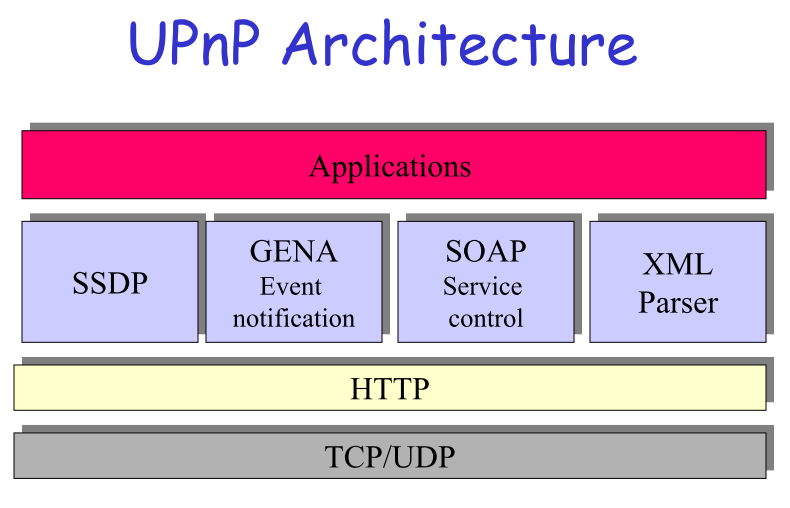
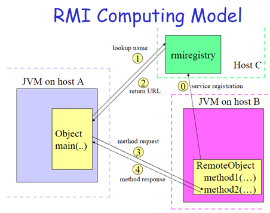

# CS3311

## A Software system consits of several collaborative components or services.

### what is the purpose of a middleware system

	It provides services such as name resolution, resource discovery and sharing, remote execution, event notification, directories and security. Therefore, any distributed application can benefit from middleware services as those mentioned above.

### define three important services that can be included in a middleware system ,showing if they can be used together or only separately to the benefit of the distributed applications.

### explain the most important differences between an object-oriented middleware system and a message-oriented one
	
	asynchronous
	message-oriented:
	Each peer connects to a messaging agent that provides means for creating, sending, receiving and reading messages.
	The sender and the receiver need to know the message format and what destination to use – loosely coupled.

## UPnP can be considered as a full middleware system.

### Draw and explain the UPnP architecture.what are its main services?

	soap(simple object access protocol)
	Simple Service Discovery Protocol
	General Event Notification Architecture.
	Extensible Markup Language (XML) 

	SSDP (Simple Service Discovery Protocol)
	Allows UPnP services to be discovered.
	GENA (Generic Event Notification Architecture)
	A subscription to a control point interested  in receiving event notifications  must be renewed periodically to continue to receive notifications, and can also be cancelled using GENA. 
	SOAP (Simple Object Access Protocol)
	SOAP defines the use of Extensible Markup Language (XML) and HTTP to execute remote procedure calls.
	UPnP uses SOAP to deliver control messages to devices and return results or errors back to control points.

-----------------------

	A UPnP device is a container of services and nested devices.
	The smallest unit of control in a UPnP network is a service. A service exposes actions and models its state with state variables.
	A control point in a UPnP network is a controller capable of discovering and controlling other devices.

### explain how one UPnP-enabled device becomes a member of a UPnP network of devices.

	It uses auto-configuration where it searches for a DHCP server (it must run a DHCP client), and if a server is not found it picks an IP address from the link-local range. An ARP request is issued to check for duplicates before the network is joined.

---------------

	not sure:
	A UPnP device may join/leave a network, advertise its services, discover and
	use other devices’ services at any time.
	It uses auto-configuration: search for a DHCP server (it must run a DHCP 
	client), if not found picks an IP address from the link-local range. An ARP 
	request is issued to check for duplicates.

### explain the role of UPnP in the home gateway project. you can use a drawing.

## remmote execution is a key service in distributed computing

### analyse the rmi computing model

### use an example to discuss the remote interface

	none

### expalain the idea of remote activation

	Services are registered with rmiregistry but not instantiated; they are inactive until called upon by a client. One special daemon process, remote method invocation activation system daemon (rmid), listens for calls and instantiates RMI services on demand.

## p2p systems have many intersing applications
 
### explain the differences between addressing in a p2p system and an ip network

### what is routing overlays 

	Routing overlays is a middleware algorithm responsible for locating hosts and objects.
	It is an application routing algorithm that delivers a request from a client to the host that stores the addressed object.
	Any object can be located anywhere in the network at any time.
	The request is routed through a set of hosts, exploiting knowledge at each of them to locate the destination.

### show how the idea of "numerically closest hosts" is used for routing in p2p systems