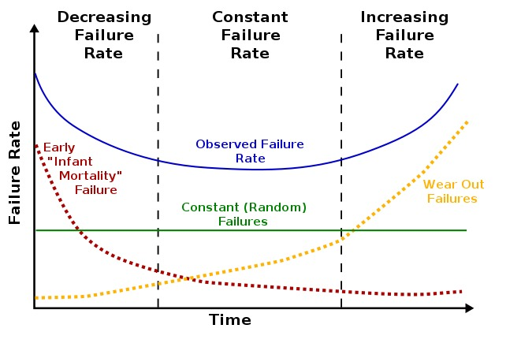

CS3500  

## what are legacy systems and why do they exist

	A legacy system is an old method, technology, computer system, or application program.

	The decision to keep an old system may be influenced by economic reasons such as return on investment challenges or vendor lock-in, the inherent challenges of change management, or a variety of other reasons other than functionality.

	Organizations can have compelling reasons for keeping a legacy system, such as:
	* The system works satisfactorily, and the owner sees no reason for changing it.
	* The costs of redesigning or replacing the system are prohibitive because it is large, monolithic, and/or complex.
	* Retraining on a new system would be costly in lost time and money, compared to the anticipated appreciable benefits of replacing it (which may be zero).
	* The system requires near-constant availability, so it cannot be taken out of service, and the cost of designing a new system with a similar availability level is high. Examples include systems to handle customers' accounts in banks, computer reservation systems, air traffic control, energy distribution (power grids), nuclear power plants, military defense installations, and systems such as the TOPS database.
	* The way that the system works is not well understood. Such a situation can occur when the designers of the system have left the organization, and the system has either not been fully documented or documentation has been lost.
	* The user expects that the system can easily be replaced when this becomes necessary.

## what are the components of an information system?what role does communication and control have in ensuring that systems remain stable

	An Information System (IS) consists of five basic resources,[53] namely:
	Personnel, which consists of IT specialists (such as a Database Administrator or Network Engineer) and end-users (such as Data Capture Clerks)
	Hardware, which consists of all the physical aspects of an information system, ranging from peripherals to computer parts and servers
	Software, which consists of System Software, Application Software and Utility Software
	Networks, which consists of communication media and network support
	Data, which consists of all the knowledge and databases in the IS

## draw the actual and idealised life-expectancy curves for software. explain precisely the reasons for ther shape of the actual curve.

