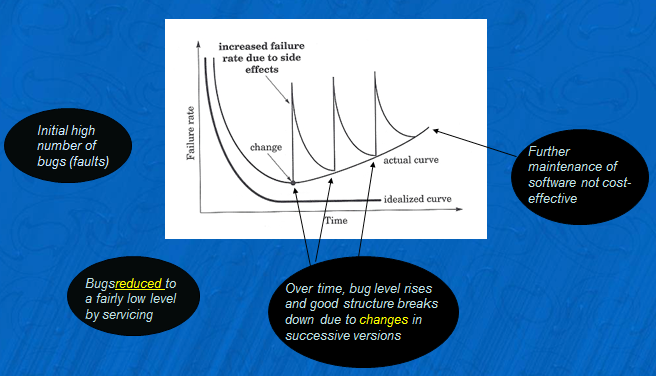

CS3500  

## what are legacy systems and why do they exist

	A legacy system is an old method, technology, computer system, or application program.

	The decision to keep an old system may be influenced by economic reasons such as return on investment challenges or vendor lock-in, the inherent challenges of change management, or a variety of other reasons other than functionality.

	Organizations can have compelling reasons for keeping a legacy system, such as:
	* The system works satisfactorily, and the owner sees no reason for changing it.
	* The costs of redesigning or replacing the system are prohibitive because it is large, monolithic, and/or complex.
	* Retraining on a new system would be costly in lost time and money, compared to the anticipated appreciable benefits of replacing it (which may be zero).
	* The system requires near-constant availability, so it cannot be taken out of service, and the cost of designing a new system with a similar availability level is high. Examples include systems to handle customers' accounts in banks, computer reservation systems, air traffic control, energy distribution (power grids), nuclear power plants, military defense installations, and systems such as the TOPS database.
	* The way that the system works is not well understood. Such a situation can occur when the designers of the system have left the organization, and the system has either not been fully documented or documentation has been lost.
	* The user expects that the system can easily be replaced when this becomes necessary.

	Legacy Systems (1)
	Legacy systems are software (and sometimes hardware) systems that have been developed sometime in the past using older or obsolete technology (e.g. COBOL).
	 Often serve business-critical functions
	 Often too risky to replace them
	 Often were developed to run on centralised mainframe machines and then modified (but not re-designed) to run on distributed PC networks   very significant source of errors

	Legacy Systems (2)
	Staff & budget shortages mean that legacy software persists in organisations rather than being replaced – obviously progress IS being made in eliminating old obsolete systems
	Legacy systems require that obsolete skills be maintained (e.g. there is still a need for COBOL and DIBOL programmers although it is unlikely that much new software has been written in these languages for the last 20 years or more.
	Legacy systems are extremely expensive to maintain because 
	    		(a) They were usually not built with modification in mind
	    		(b) Written in 2 & 3 GL code which has low productivity

## what are the components of an information system?what role does communication and control have in ensuring that systems remain stable

	An Information System (IS) consists of five basic resources,[53] namely:
	Personnel, which consists of IT specialists (such as a Database Administrator or Network Engineer) and end-users (such as Data Capture Clerks)
	Hardware, which consists of all the physical aspects of an information system, ranging from peripherals to computer parts and servers
	Software, which consists of System Software, Application Software and Utility Software
	Networks, which consists of communication media and network support
	Data, which consists of all the knowledge and databases in the IS

## draw the actual and idealised life-expectancy curves for software. explain precisely the reasons for ther shape of the actual curve.

## waterfall model  

	### Advantages of waterfall model:

	- Simple and easy to understand and use.
	- Easy to manage due to the rigidity of the model – each phase has specific deliverables and a review process.
	- Phases are processed and completed one at a time.
	- Works well for smaller projects where requirements are very well understood.
	 
	### Disadvantages of waterfall model:

	- Once an application is in the testing stage, it is very difficult to go back and change something that was not well-thought out in the concept stage.
	- No working software is produced until late during the life cycle.
	- High amounts of risk and uncertainty.
	- Not a good model for complex and object-oriented projects.
	- Poor model for long and ongoing projects.
	- Not suitable for the projects where requirements are at a moderate to high risk of changing.

## List four basic recommendations made by the Agile Alliance in 2001.

	- Individuals and interactions between them have  priority over processes and tools
	- Working software takes precedence over comprehensive documentation
	- Customer collaboration more important than contract negotiation
	- Ability to respond to change more important than sticking blindly to a plan

## differences between prototyping and exploratory programming. example of them.

	Prototyping:
	exploratory:Smalltalk